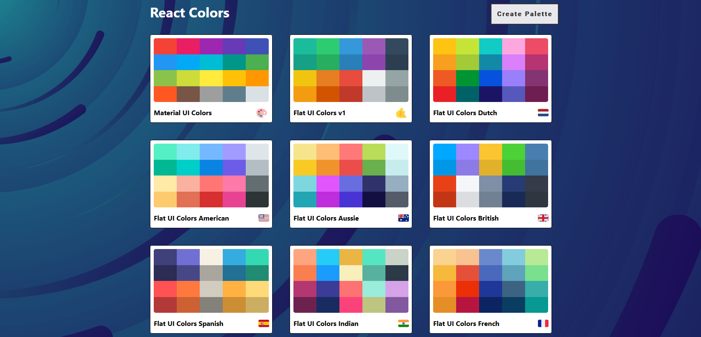

<div id="top"></div>

<!-- PROJECT SHIELDS -->


<!-- PROJECT LOGO -->
</br>
<div align="center">
      <a href="https://react-ui-colors.vercel.app/">
       
      </a>
    <p>
    <h1 align="center">React-Color-App</h1>
    <a href="https://react-ui-colors.vercel.app/">View Demo</a>
    ·
    <a href="https://github.com/ahmedalam98/React-Color-App/issues">Report Bug</a>
    </p>
</div>

<!-- TABLE OF CONTENTS -->
<details>
  <summary>Table of Contents</summary>
  <ol>
    <li>
      <a href="#about-the-project">About The Project</a>
      <ul>
      <li><a href="#built-with">Built With</a></li>
      <li><a href="#features">Features</a></li>
      </ul>
    </li>
    <li>
      <a href="#getting-started">Getting Started</a>
      <ul>
        <li><a href="#installation">Installation</a></li>
      </ul>
    </li>
    <li><a href="#contributing">Contributing</a></li>
  </ol>
</details>

<!-- ABOUT THE PROJECT -->

## About The Project

A clone of websites like Flat UI Colors and Material UI Colors using React.




### Built With

- React
- Material-UI
- React Color
- chroma-js
- emoji-mart
- rc-slider
- react-copy-to-clipboard
- react-material-ui-form-validator
- react-router
- react-transition-group
- svg-backgrounds

### Features

- List default palettes with ability to delete palettes
- Create custom color palette:
  - contains colors entered by user through color picker or (Random Color) button
  - enable user to change the order of ColorBoxes by **Drag & Drop**
  - enable user to save custom palette with name and emoji 🚀
- Explore color palettes and generate different color levels with slider
- Click on color box to **copy** color code with the ability to change the color format from:
  - `HEX` format
  - `RGB` format
  - `RGBA` format
- Click on `More` button on each color box to generate different shades from selected color

<p align="right">(<a href="#top">back to top</a>)</p>

---

## Getting Started

This project require some perquisites and dependencies to be installed, you can view it online using this [demo](https://react-ui-colors.vercel.app/). or you can find the instructions below:

### Installation

> To get a local copy, follow these simple steps :

1. Clone the repo

   ```sh
   git clone https://github.com/ahmedalam98/React-Color-App.git
   ```

2. go to project folder

   ```sh
   cd REACT-COLOR-APP
   ```

3. install dependencies

   ```bash
   npm install --force
   ```

4. Run development server

   ```sh
   npm start
   ```

<p align="right">(<a href="#top">back to top</a>)</p>

---

<!-- CONTRIBUTING -->

## Contributing

Contributions are always welcome!

If you have a suggestion that would make this better, please fork the repo and create a pull request. You can also simply open an issue with the tag "enhancement".
Don't forget to give the project a star! Thanks again!

1. Fork the Project
2. Create your Feature Branch (`git checkout -b feature/AmazingFeature`)
3. Commit your Changes (`git commit -m 'Add some AmazingFeature'`)
4. Push to the Branch (`git push origin feature/AmazingFeature`)
5. Open a Pull Request

<p align="right">(<a href="#top">back to top</a>)</p>

<!-- ACKNOWLEDGMENTS -->

## Acknowledgments

- [Colt](https://github.com/Colt)
